# 📊 ScoreLens – Student Performance EDA

A comprehensive exploratory data analysis on how academic performance is influenced by social, behavioral, and demographic factors like gender, lunch type, test prep, family background, and more.

---

## 📁 Dataset
- `student_scores.csv` – student performance & demographic information

---

## 🧰 Tools & Technologies
- Python (Pandas, Seaborn, Matplotlib)
- Jupyter Notebook

---

## 📈 Visualizations & Insights

### 👩‍🏫 Gender Distribution
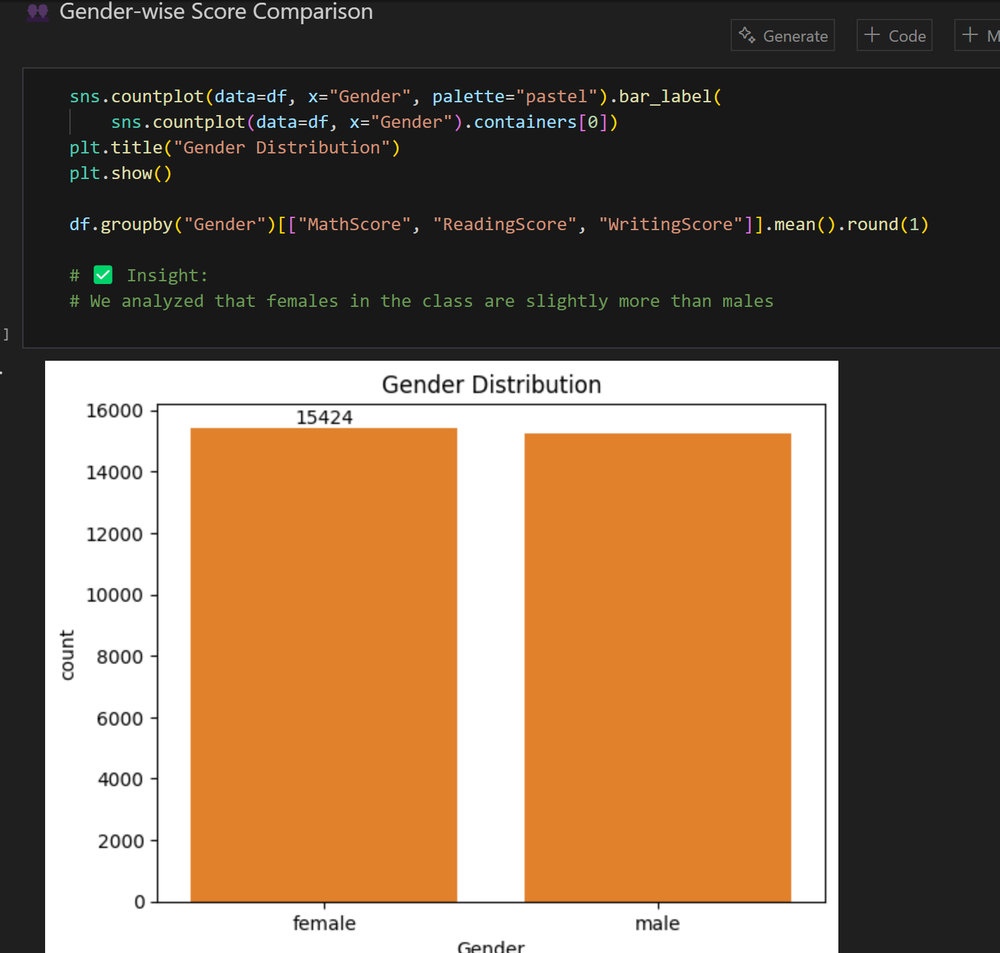

- ✅ Insight: Females slightly outnumber males in the dataset.

---

### 📊 Average Scores by Gender
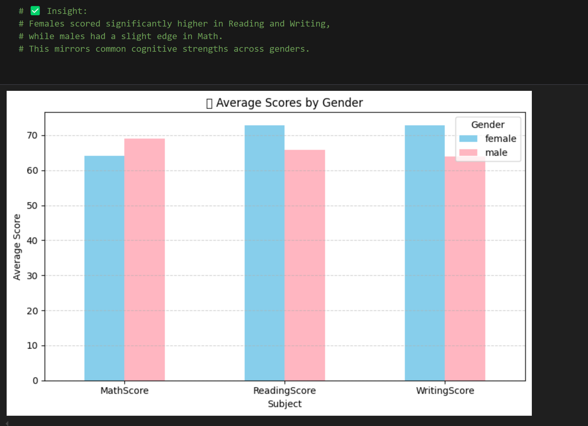

- ✅ Insight: Females scored higher in Reading & Writing.  
- Males had a slight edge in Math.

---

### 🌐 Ethnic Group Distribution
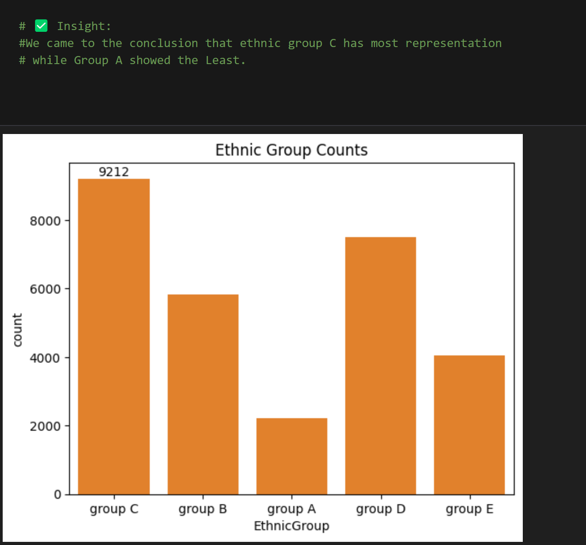

- ✅ Insight: Group C had the highest representation. Group A was the lowest.

---

### 📊 Ethnic Group vs Scores
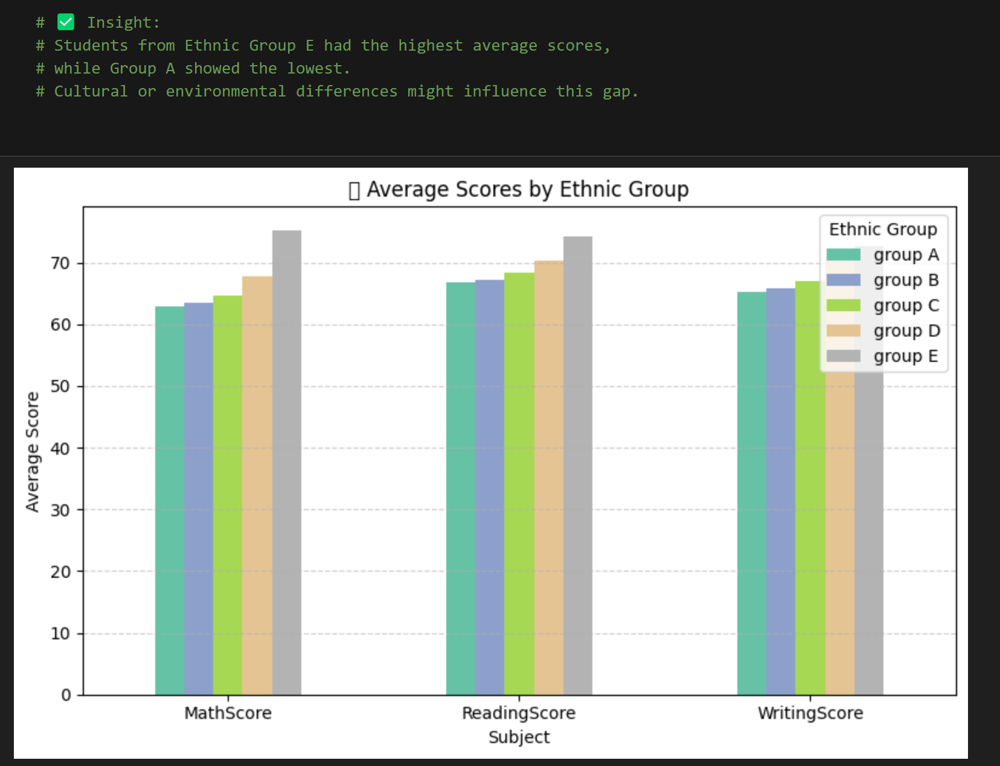

- ✅ Insight: Group E students scored the highest on average; Group A scored the lowest.

---

### 🍱 Lunch Type vs Scores

- ✅ Insight: Students with standard lunch scored 10–12 points higher than those with free/reduced lunch.

---

### 🧪 Test Preparation Effect
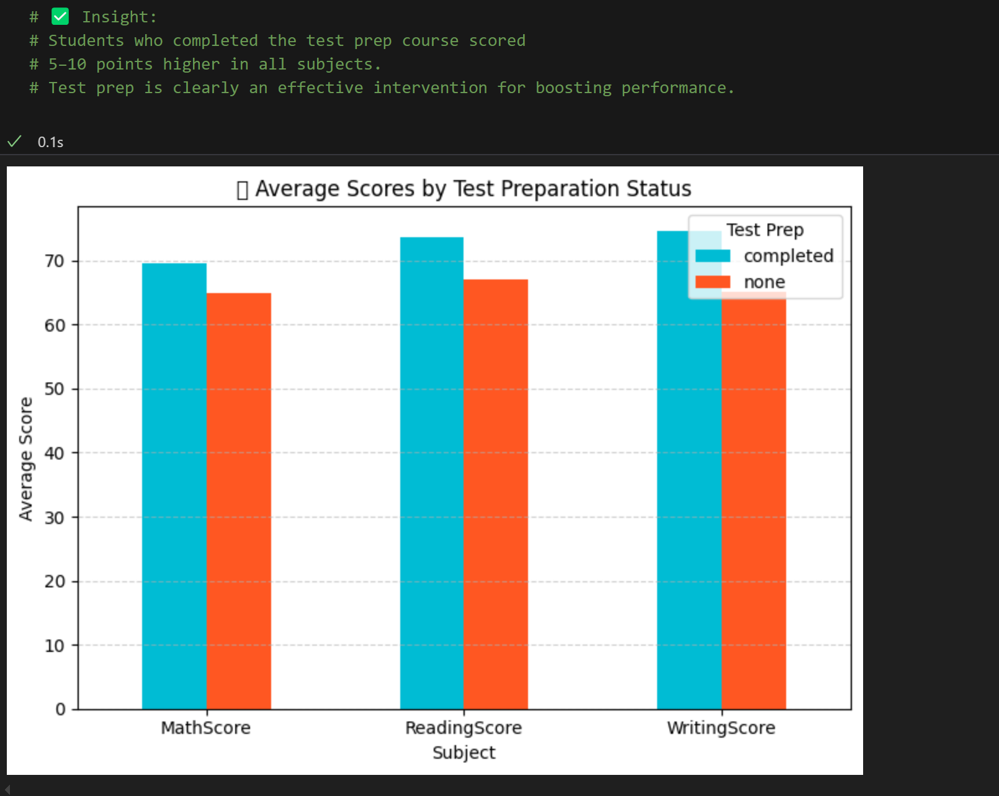

- ✅ Insight: Students who completed test prep scored 5–10 points higher across all subjects.

---

### 📚 Weekly Study Hours

- ✅ Insight: Students who studied more than 10 hours/week performed significantly better.

---

### 🍼 First Child vs Others
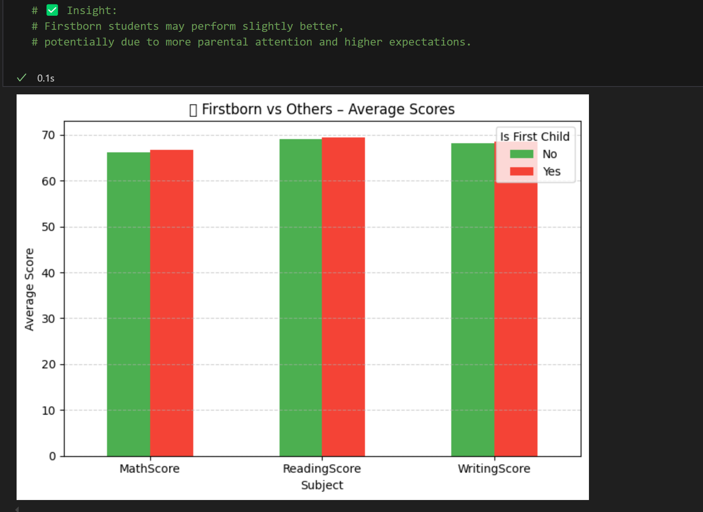

- ✅ Insight: Firstborns slightly outperformed others, possibly due to more parental attention.

---

### 👨‍👧 Number of Siblings
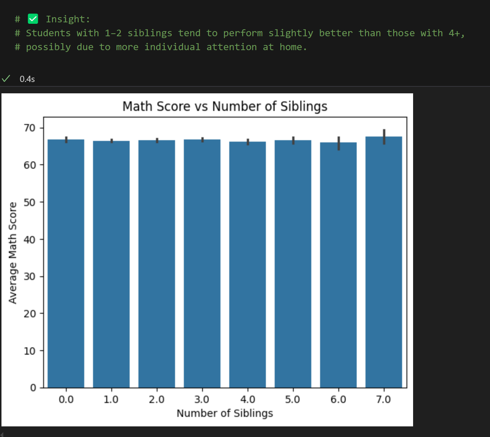

- ✅ Insight: Students with fewer siblings had better average scores.

---

### 💔 Parental Marital Status
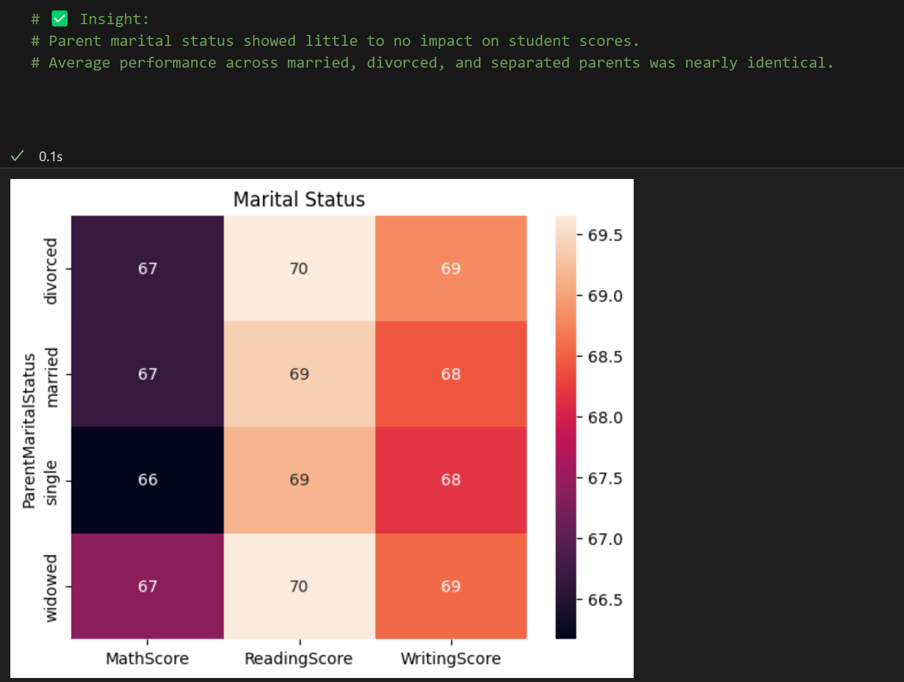

- ✅ Insight: No major difference was observed based on parental marital status.

---

### 🚗 Transport Method
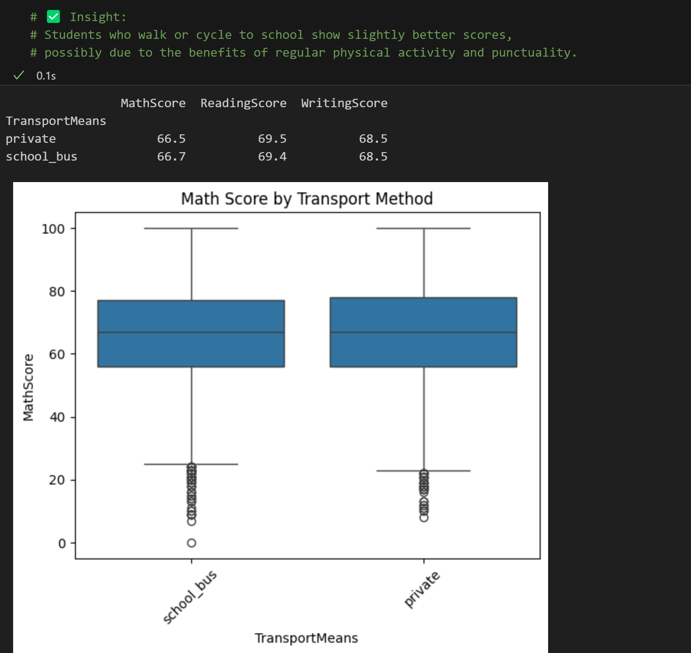

- ✅ Insight: Students who walk or cycle to school performed slightly better.

---

### 📶 Correlation of Test Scores
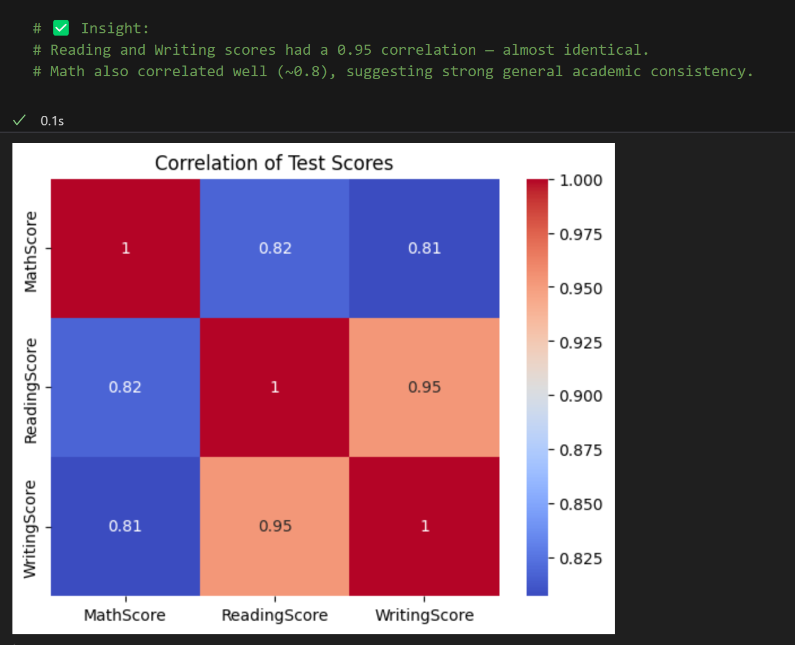

- ✅ Insight: Reading and Writing scores had a 0.95 correlation.  
- Math was moderately correlated (~0.8), showing consistency across subjects.

---

### ⚠️ Outliers
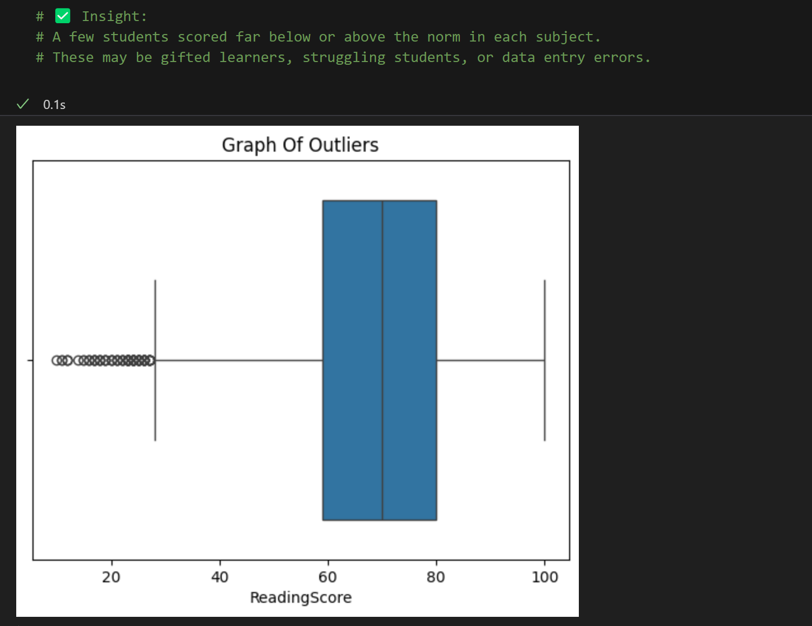

- ✅ Insight: Outliers were found in all subjects — useful for targeted intervention or review.

---

### 🧠 Parental Education Level
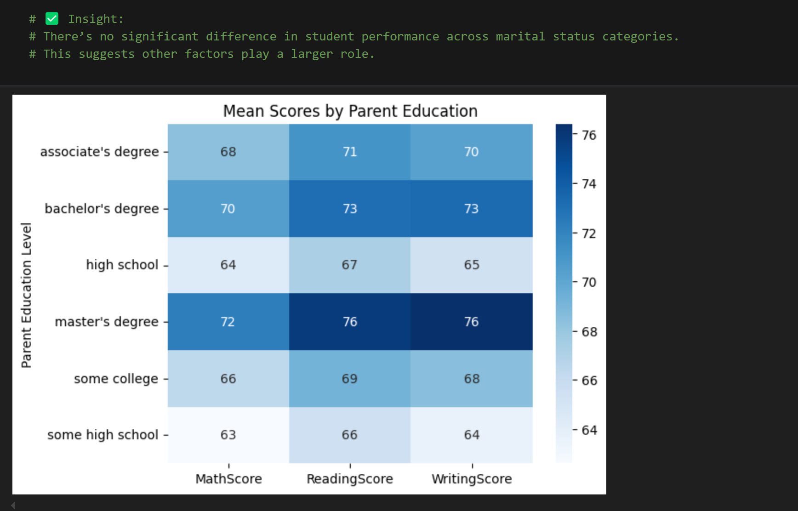

- ✅ Insight: Students with more educated parents (Bachelor’s/Master’s) scored 10–15 points higher on average.

---

## 📌 Summary of Key Takeaways

- 📈 **Higher parental education** → better student performance
- 🧪 **Test prep** and **study time** have direct positive effects
- 🍱 **Lunch type** is a socioeconomic indicator of success
- 👩‍👧 **Firstborns & smaller families** showed slight academic advantage
- 📚 **Reading & writing** scores are tightly correlated (0.95+)
- ✅ Outliers detected for intervention

---

## ▶️ How to Run This Project

1. Clone this repo  
2. Ensure `student_scores.csv` is in the same folder  
3. Open `student_marks_full_EDA.ipynb` in Jupyter Notebook or VS Code  
4. Run all cells to reproduce the visualizations and insights

---

## 💼 Contact

- GitHub: [github.com/hrspunia](https://github.com/hrspunia)  
- LinkedIn: [linkedin.com/in/hrspunia](https://linkedin.com/in/hrspunia)
